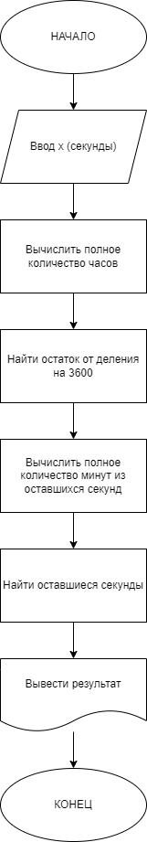
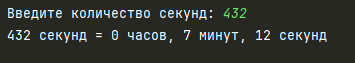
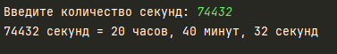

# Практическая работа №1 #

### Тема: Применение операции присваивания и описание переменных ###

### Цель: приобретение навыков составления программ на основе простейших алгоритмов ###

#### Ход работы ####

##### Задание: #####
> Сколько полных часов, минут и секунд содержится в x секундах? Разложите имеющееся количество секунд
> на сумму из x часов + y минут + z секунд.

##### Блок-схема: #####


##### Код программы: #####
```python
def convert_seconds(x):
    hours = x // 3600
    remaining_seconds_after_hours = x % 3600
    minutes = remaining_seconds_after_hours // 60
    seconds = remaining_seconds_after_hours % 60

    return hours, minutes, seconds

x = int(input("Введите количество секунд: "))
hours, minutes, seconds = convert_seconds(x)
print(f"{x} секунд = {hours} часов, {minutes} минут, {seconds} секунд")
```
##### Результат работы программы: #####

* Вводим число ```432``` и получаем результат:


* Вводим число ```74432``` и получаем результат:



##### Вывод по проделанной работе: #####
> Легкая практическая работа, так как алгоритмы программы простые
