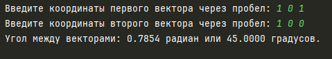

# Практическая работа №2 #

### Тема: Решение линейных задач и работа в среде программирования Питон ###

### Цель: приобрести навыки составления линейных программ ###

#### Ход работы ####

##### Задание: #####
> Даны координаты двух векторов. Найдите угол между векторами

##### Блок-схема: #####


##### Код программы: #####
```python
import math

def find_angle_between_vectors(a, b):
    # Скалярное произведение векторов
    dot_product = a[0] * b[0] + a[1] * b[1] + a[2] * b[2]

    # Вычисление длин векторов
    magnitude_a = math.sqrt(a[0] ** 2 + a[1] ** 2 + a[2] ** 2)
    magnitude_b = math.sqrt(b[0] ** 2 + b[1] ** 2 + b[2] ** 2)

    # Проверка на нулевые векторы
    if magnitude_a == 0 or magnitude_b == 0:
        return "Один из векторов является нулевым, угол не определен."

    # Косинус угла между векторами
    cos_theta = dot_product / (magnitude_a * magnitude_b)

    # Ограничение значения косинуса в диапазоне [-1, 1] для избежания ошибок вычислений
    cos_theta = max(min(cos_theta, 1), -1)

    # Вычисление угла в радианах и градусах
    theta_radians = math.acos(cos_theta)
    theta_degrees = math.degrees(theta_radians)

    return theta_radians, theta_degrees

# Ввод координат векторов
a = list(map(float, input("Введите координаты первого вектора через пробел: ").split()))
b = list(map(float, input("Введите координаты второго вектора через пробел: ").split()))

# Проверка размерности векторов
if len(a) != 3 or len(b) != 3:
    print("Векторы должны быть трехмерными!")
else:
    result = find_angle_between_vectors(a, b)
    if isinstance(result, str):
        print(result)
    else:
        radians, degrees = result
        print(f"Угол между векторами: {radians:.4f} радиан или {degrees:.4f} градусов.")
```
##### Результат работы программы: #####

* Вводим координаты первого вектора ```1 0 0``` и второго вектора ```0 1 0```, получаем результат:


* Вводим координаты первого вектора ```1 0 1``` и второго вектора ```1 0 0```, получаем результат:


* Вводим координаты первого вектора ```0 0 0``` и второго вектора ```0 0 0```, получаем результат:


* Вводим координаты первого вектора ```1 1 1``` и второго вектора ```0 1 0```, получаем результат:


##### Вывод по проделанной работе: #####
> Это практика немного сложнее, так как мне пришлось использовать Qwen Chat для нахождения угла между векторами