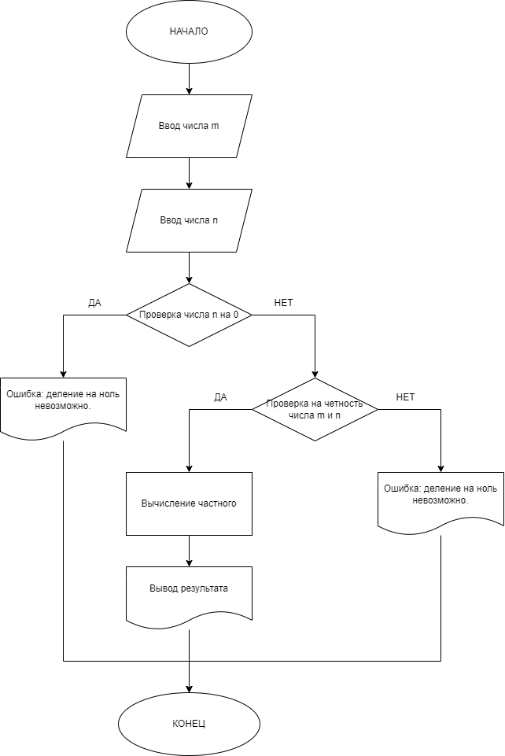
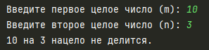
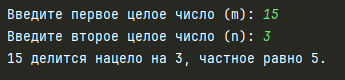

# Практическая работа №3 #

### Тема: Составление программ задач c ветвлением и реализация построенных алгоритмов в виде программ на языке программирования Питон ###

### Цель: приобретение навыков составления программ на основе алгоритмов ветвления ###

#### Ход работы ####

##### Задание: #####
> Запросите у пользователя два целых числа m и n. Если целое число m делится нацело на целое число n,то вывести на экран частное от деления, в противном случае вывести сообщение «m на n на цело не делится».

##### Блок-схема: #####


##### Код программы: #####
```python
m = int(input("Введите первое целое число (m): "))
n = int(input("Введите второе целое число (n): "))

# Проверка деления
if n == 0:
    print("Ошибка: деление на ноль невозможно.")
else:
    if m % n == 0:
        quotient = m // n
        print(f"{m} делится нацело на {n}, частное равно {quotient}.")
    else:
        print(f"{m} на {n} нацело не делится.")
```
##### Результат работы программы: #####

* Вводим число m: ```10``` и число n: ```3```, получаем результат:


* Вводим число m: ```15``` и число n: ```3```, получаем результат:


##### Вывод по проделанной работе: #####
> Принцип алгоритма ветвления довольно таки прост, по этому решение задачи не составила особого труда