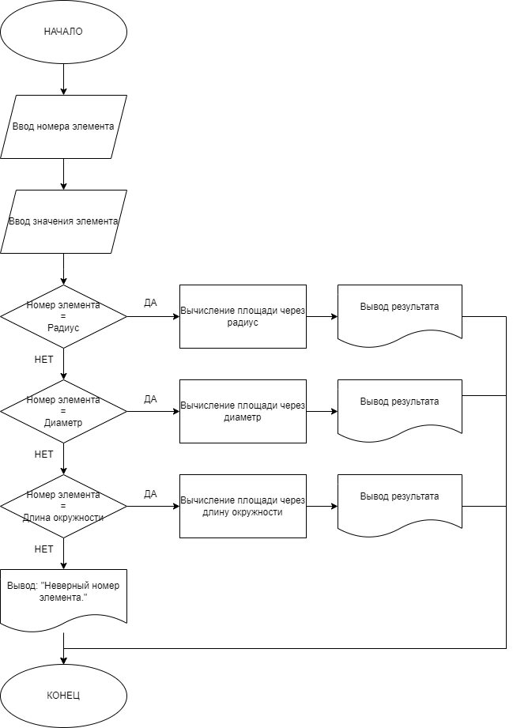
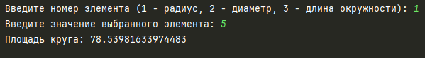
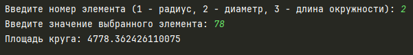
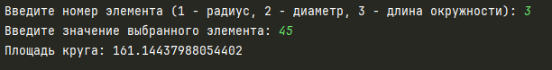
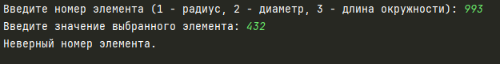
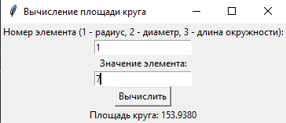
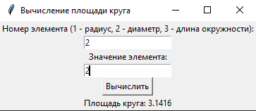
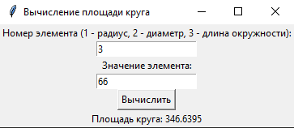
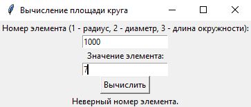

# Практическая работа №4 #

### Тема: Применение оператора множественного выбора ###

### Цель: приобретение навыков составления программ на основе алгоритмов множественного выбора ###

#### Ход работы ####

##### Задание: #####
> Пусть элементами круга являются радиус (первый элемент), диаметр (второй элемент) и длина окружности (третий элемент). Составить программу, которая по номеру элемента запрашивает соответствующее значение и вычисляет площадь круга.

##### Блок-схема: #####


##### Код программы (Консольный вариант): #####
```python
import math

element_number = int(input("Введите номер элемента (1 - радиус, 2 - диаметр, 3 - длина окружности): "))
value = float(input("Введите значение выбранного элемента: "))

# Вычисление площади круга
if element_number == 1:  # Радиус
    area = math.pi * value**2
elif element_number == 2:  # Диаметр
    area = math.pi * (value / 2)**2
elif element_number == 3:  # Длина окружности
    area = (value**2) / (4 * math.pi)
else:
    print("Неверный номер элемента.")
    exit()

print(f"Площадь круга: {area}")
```

##### Код программы (Оконный вариант): #####
```python
import tkinter as tk
import math


def calculate_area():
    element_number = int(entry_number.get())
    value = float(entry_value.get())

    # Вычисление площади круга
    if element_number == 1:  # Радиус
        area = math.pi * value ** 2
    elif element_number == 2:  # Диаметр
        area = math.pi * (value / 2) ** 2
    elif element_number == 3:  # Длина окружности
        area = (value ** 2) / (4 * math.pi)
    else:
        result.set("Неверный номер элемента.")
        return

    result.set(f"Площадь круга: {area:.4f}")


# Создание главного окна
root = tk.Tk()
root.title("Вычисление площади круга")

# Переменная для вывода результата
result = tk.StringVar()

tk.Label(root, text="Номер элемента (1 - радиус, 2 - диаметр, 3 - длина окружности):").pack()
entry_number = tk.Entry(root)
entry_number.pack()

tk.Label(root, text="Значение элемента:").pack()
entry_value = tk.Entry(root)
entry_value.pack()

tk.Button(root, text="Вычислить", command=calculate_area).pack()

result_label = tk.Label(root, textvariable=result)
result_label.pack()

root.mainloop()
```

##### Результат работы программы (Консольный вариант): #####
* Вводим номер элемента: ```1```, вводим значение элемента: ```5```, получаем результат:


* Вводим номер элемента: ```2```, вводим значение элемента: ```78```, получаем результат:


* Вводим номер элемента: ```3```, вводим значение элемента: ```45```, получаем результат:


* Вводим номер элемента: ```993```, вводим значение элемента: ```432```, получаем результат:


##### Результат работы программы (Оконный вариант): #####
* Вводим номер элемента: ```1```, вводим значение элемента: ```7```, получаем результат:



* Вводим номер элемента: ```2```, вводим значение элемента: ```2```, получаем результат:



* Вводим номер элемента: ```3```, вводим значение элемента: ```66```, получаем результат:



* Вводим номер элемента: ```1000```, вводим значение элемента: ```7```, получаем результат:



##### Вывод по проделанной работе: #####
> Оператор множественного выбора все также прост. Использование библиотеки math упростила задачу, так как не пришлось вводить полностью число Pi.