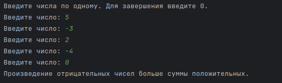
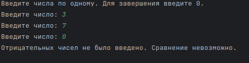
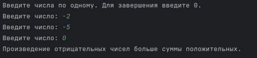
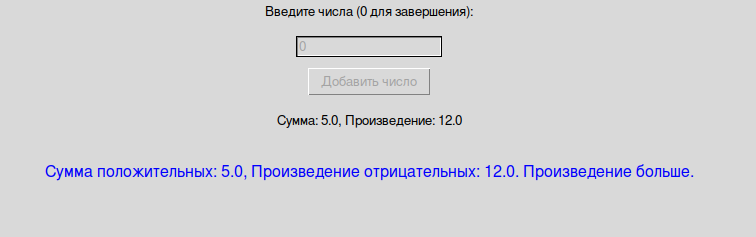
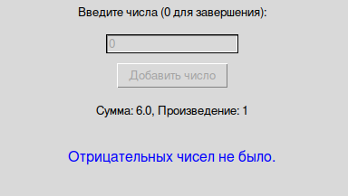
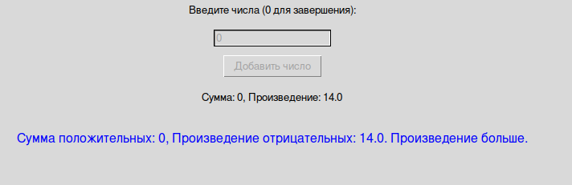

# Практическая работа №5 #

### Тема: Решение циклических задач ###

### Цель: совершенствование навыков составления программ на основе циклов с предусловием и постусловием ###

#### Ход работы ####

##### Задание: #####
> В последовательности чисел сравнить, что больше сумма положительных или произведение
отрицательных
> 
##### Блок-схема: #####


##### Код программы (Консольный вариант): #####
```python
# Инициализация переменных
sum_positive = 0  # Сумма положительных чисел
product_negative = 1  # Произведение отрицательных чисел
has_negative = False  # Флаг для проверки наличия отрицательных чисел

print("Введите числа по одному. Для завершения введите 0.")
while True:
    num = float(input("Введите число: "))

    if num > 0:
        sum_positive += num
    elif num < 0:
        product_negative *= num
        has_negative = True
    else:
        break

# Сравнение результатов
if has_negative:
    if sum_positive > product_negative:
        print("Сумма положительных чисел больше произведения отрицательных.")
    elif sum_positive < product_negative:
        print("Произведение отрицательных чисел больше суммы положительных.")
    else:
        print("Сумма положительных чисел равна произведению отрицательных.")
else:
    print("Отрицательных чисел не было введено. Сравнение невозможно.")
```

##### Код программы (Оконный вариант): #####
```python
import tkinter as tk
from tkinter import messagebox

# Инициализация переменных
sum_positive, product_negative, has_negative = 0, 1, False

# Функция для обработки ввода числа
def process_number():
    global sum_positive, product_negative, has_negative
    try:
        num = float(entry.get())
        if num == 0:  # Завершение ввода
            entry.config(state=tk.DISABLED)
            add_button.config(state=tk.DISABLED)
            result_label.config(text="Отрицательных чисел не было." if not has_negative
                                else f"Сумма положительных: {sum_positive}, Произведение отрицательных: {product_negative}. "
                                     f"{'Сумма больше.' if sum_positive > product_negative else 'Произведение больше.'}")
        elif num > 0:
            sum_positive += num
        elif num < 0:
            product_negative *= num
            has_negative = True
        entry.delete(0, tk.END)
        current_values_label.config(text=f"Сумма: {sum_positive}, Произведение: {product_negative}")
    except ValueError:
        messagebox.showerror("Ошибка", "Введите корректное число!")

# Создание главного окна
root = tk.Tk()
root.title("Сравнение суммы и произведения")
root.geometry("400x250")

# Метка с инструкцией
tk.Label(root, text="Введите числа (0 для завершения):").pack(pady=10)

# Поле ввода числа
entry = tk.Entry(root, width=20)
entry.pack(pady=5)

# Кнопка для добавления числа
add_button = tk.Button(root, text="Добавить число", command=process_number)
add_button.pack(pady=5)

# Метка для отображения текущих значений
current_values_label = tk.Label(root, text=f"Сумма: {sum_positive}, Произведение: {product_negative}")
current_values_label.pack(pady=10)

# Метка для вывода результата
result_label = tk.Label(root, text="", font=("Arial", 12), fg="blue")
result_label.pack(pady=20)

# Запуск главного цикла
root.mainloop()
```

##### Результат работы программы (Консольный вариант): #####
* Вводим числа: ```5 -3 2 -4 0```, получаем результат:



* Вводим числа: ```3 7 0```, получаем результат:



* Вводим числа: ```-2 -5 0```, получаем результат:



##### Результат работы программы (Оконный вариант): #####
* Вводим числа: ```-3 -4 5 0```, получаем результат:



* Вводим числа: ```2 4 0```, получаем результат:



* Вводим числа: ```-7 -2 0```, получаем результат:


* 
##### Вывод по проделанной работе: #####
> Цикл while довольно простой. Само задание понятно. Из этого можно сделать вывод: Задание очень легкое